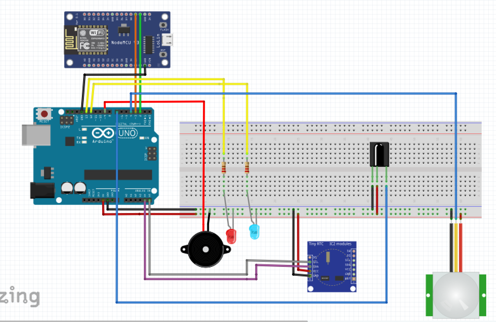

# IoT-Based Intrusion Detection System Using NodeMCU and Arduino

## 📘 Overview

This project presents an **IoT-based intrusion detection system** that combines **NodeMCU** and **Arduino** to create a cost-effective, reliable home and office security solution.
The system detects motion using a **PIR sensor**, receives signals via an **IR sensor**, and triggers **LED** and **buzzer** alerts when an intrusion occurs.

---

## 👥 Team Information

**Course:** IOT102t — SU2024
**Class:** SE1831 — Group 4
**Instructor:** Nguyen Tri Thong

**Group Members:**

* Bui Minh Thang — SE180564
* Bui Anh Kha — SE181730
* Dao Cong An Phuoc — SE180581
* Nguyen Anh Quan — SE180619

---

## 🧩 Components Used

| Component             | Description                                                            |
| --------------------- | ---------------------------------------------------------------------- |
| **NodeMCU (ESP8266)** | Connects to Wi-Fi and sends intrusion alerts to Blynk or server.       |
| **Arduino Uno R3**    | Acts as main controller, reading sensor inputs and triggering outputs. |
| **PIR Sensor**        | Detects motion by measuring infrared light from nearby objects.        |
| **IR Sensor**         | Receives remote control signals.                                       |
| **LED Light**         | Visual indicator that turns on upon intrusion detection.               |
| **Buzzer**            | Audible alarm to alert intrusion.                                      |
| **RTC Module**        | Keeps real-time clock data and timestamps intrusion events.            |

---

## 🔌 Pin Configuration

| Arduino Pin | ESP8266 | PIR Sensor | IR Sensor | LED (Normal) | LED (Alarm) | Buzzer | RTC |
| ----------- | ------- | ---------- | --------- | ------------ | ----------- | ------ | --- |
| GND         | GND     | GND        | GND       | GND          | GND         | GND    | GND |
| 5V          | -       | VCC        | VCC       | -            | -           | -      | VCC |
| D2          | TX      | -          | -         | -            | -           | -      | -   |
| D3          | RX      | -          | -         | -            | -           | -      | -   |
| D4          | -       | OUT        | -         | -            | -           | -      | -   |
| D7          | -       | -          | OUT       | -            | -           | -      | -   |
| D9          | -       | -          | -         | -            | -           | +      | -   |
| D12         | -       | -          | -         | +            | -           | -      | -   |
| D13         | -       | -          | -         | -            | +           | -      | -   |
| A4          | -       | -          | -         | -            | -           | -      | SDA |
| A5          | -       | -          | -         | -            | -           | -      | SCL |

---

## 🧠 Software Logic

The Arduino and NodeMCU are programmed using **Arduino IDE**.

**Main logic flow:**

1. Initialize all components.
2. Continuously monitor sensor input.
3. If motion detected by PIR sensor:

   * Turn ON LED.
   * Activate buzzer.
   * Send intrusion alert via Wi-Fi.

---

## 📊 Results & Discussion

* The prototype successfully detected motion using the PIR sensor.
* The LED and buzzer were triggered instantly upon intrusion detection.
* The NodeMCU provided Wi-Fi connectivity for real-time alerts.
* The system can be extended to support remote monitoring and smart home integration.

---

## 🧾 Project Timeline

| Task             | Deliverable         | Duration              |
| ---------------- | ------------------- | --------------------- |
| Proposal Writing | Proposal            | May 11 – May 18, 2024 |
| Circuit Design   | Circuit Diagram     | May 25 – Jun 1, 2024  |
| Programming      | Code Implementation | Jun 8 – Jun 22, 2024  |
| Testing          | Test Report         | Jun 22 – Jun 28, 2024 |
| Final Report     | Paper               | Jun 26 – Jun 28, 2024 |

---

## 🧩 Future Improvements

* Integrate **cloud storage** for intrusion logs.
* Enable **mobile app notifications** using Blynk or Firebase.
* Add **camera module** for image capture on intrusion.
* Expand to **multi-sensor network** for larger areas.

---

## 🎥 Demo Video

You can view the system demonstration below:

<video src="public/demo.mp4" controls width="600"></video>

> If the video doesn’t play directly on GitHub, click [**this link**](public/demo.mp4?raw=true) to view or download it.

---

## 📷 Gallery

### 🔲 Block Diagram

### 🧭 Circuit Map

### 🔁 Flowchart

---

## ⚙️ How to Run

1. Open `.ino` file in **Arduino IDE**.
2. Connect your **Arduino Uno R3** and **NodeMCU**.
3. Install required libraries (`WiFi`, `Blynk`, etc.).
4. Upload the sketch.
5. Observe alerts via Serial Monitor or Blynk app.

---

## 📚 References

1. D. N. M. Dang et al., *“Her: Hybrid approach to enhance reliability in IoT networks,”* Proc. of Int. Conf. on IoT, 2014.
2. N. T. Anh and D. N. Minh Dang, *“Waste management system using IoT,”* *Journal of Environmental Science*, vol. 8, no. 3, 2020.
3. W. Li and X. Zhang, *“IoT Security: A Survey,”* *IEEE Internet of Things Journal*, vol. 5, no. 6, 2018.
